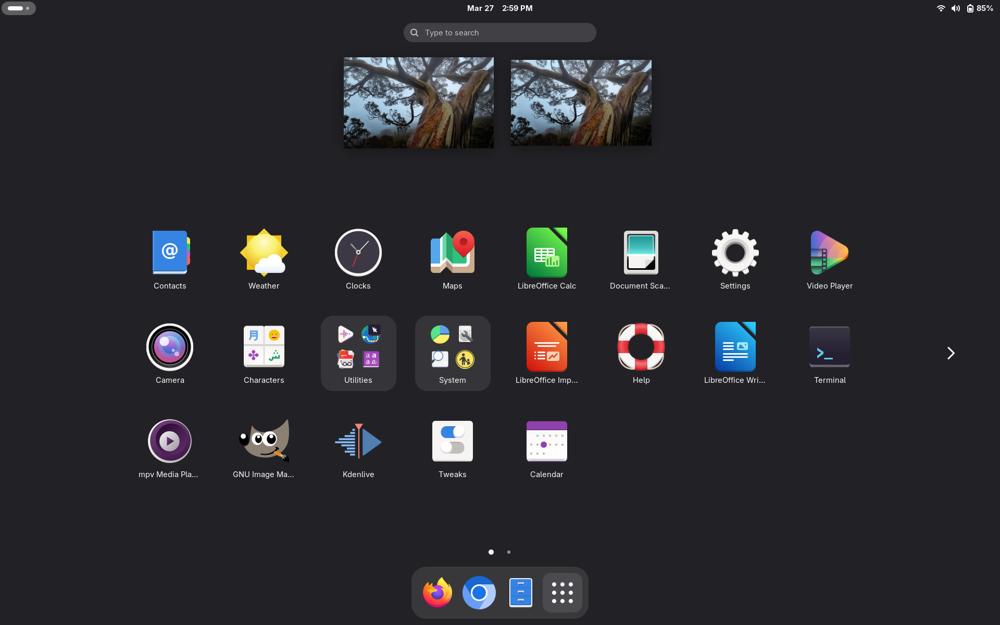
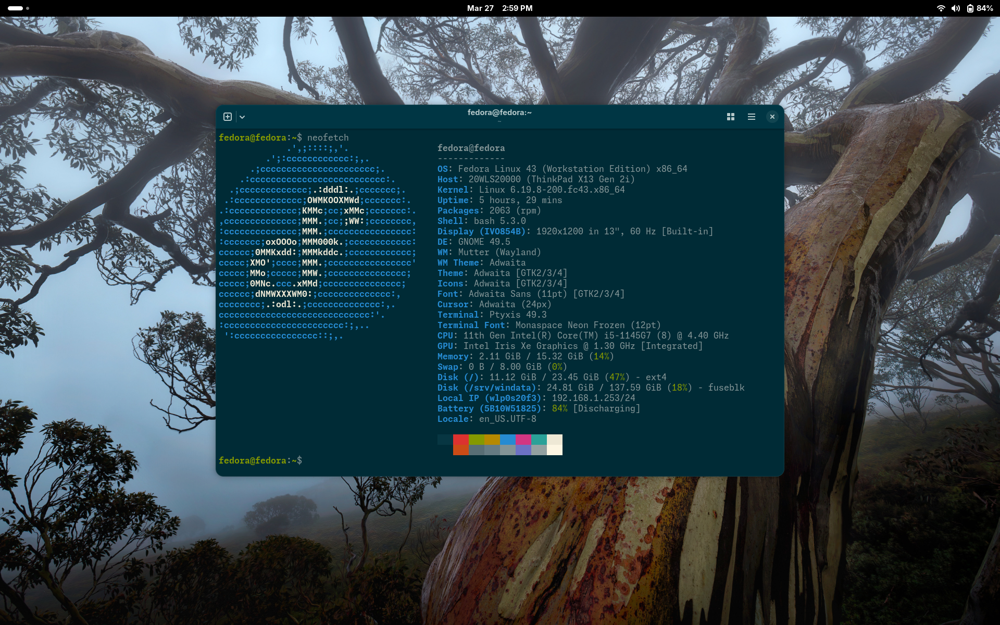
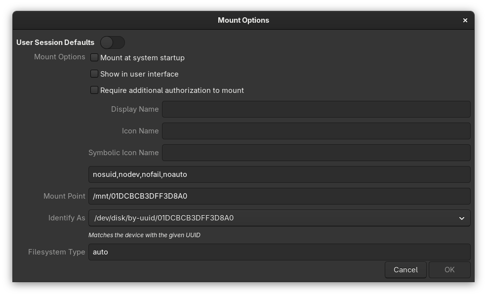

hello, this is my FEDORA WORKSTATION in 2026 on my new thinkpad X13

in this repo I use MangoWC

not many config because all can be done by clicking by GUI.




## Post Install

Add RPM FUSION and Non FREE repo

To enable the Free repository, use:

```
```
```
$ sudo dnf install \
https://download1.rpmfusion.org/free/fedora/rpmfusion-free-release-$(rpm -E %fedora).noarch.rpm
```

Optionally, enable the Nonfree repository:

```    

$ sudo dnf install \
https://download1.rpmfusion.org/nonfree/fedora/rpmfusion-nonfree-release-$(rpm -E %fedora).noarch.rpm
```

The first time you attempt to install packages from these repositories, the dnf utility prompts you to confirm the signature of the repositories. Confirm it.

[link](https://docs.fedoraproject.org/en-US/quick-docs/rpmfusion-setup/)

Then install MPV

```
sudo dnf install ffmpeg-free ffmpeg --allowerasing
```


install another software

```

sudo dnf install chromium btop gimp kdenlive darktable gparted gnome-tweaks
```

## Terminal

I use **PTYXIS** by default, both on mangowc and Gnome

## file manager

I can't life without Nautilus

> just hide the ntfs drive appears on it from DISK>Edit Mountpoints



## Mango WM

I have try so many window managers, but MangoWC is the best so far. Clean, light, has many features and minimalist.


